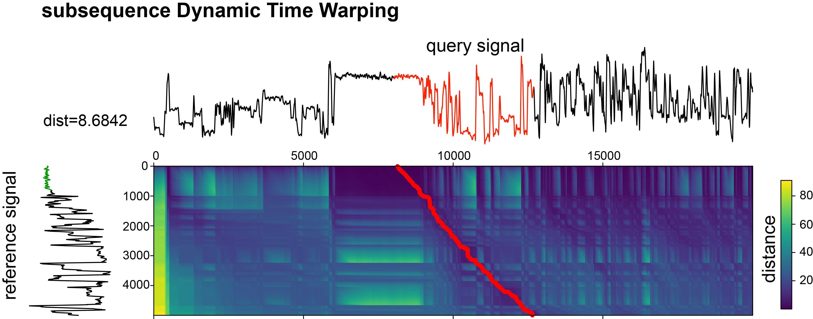

# sDTW_mRNA-1273
Subsequence Dynamic Time Warping functions used for the identification of mRNA-1273 or BNT162b2 reads in the nanopore DRS raw sequencing data (accompanying article: SARS-CoV-2 mRNA vaccine is re-adenylated in vivo, enhancing antigen production and immune response, in revision). 

Reference signals were obtained using [DTW_get_reference_singal.py] script:
* for mRNA-1273 from one of the reads from the DRS run of crude mRNA-1273 material (read id: [df408ab3-7418-4ee4-9a67-92743257b20a](mRNA_1273_df408ab3-7418-4ee4-9a67-92743257b20a.tsv)), which was giving good coverage of 3’end of mRNA-1273 reference. The reference contains 5000 sampling points from the raw current DRS readout, 1000 coming from poly(A) tail, to have a good anchoring to the 3'UTR of mRNA-1273, and the rest covering the 3'UTR.
* for BNT162b2-1273 from one of the reads from the DRS run of crude BNT162b2 material (read id: [045d4b9c-9222-425b-a7a4-9abb3597f9dd](BNT162b2_045d4b9c-9222-425b-a7a4-9abb3597f9dd.tsv)), which was giving good coverage of 3’end of BNT162b2 reference. The reference contains 5000 sampling points from the raw current DRS readout, 1000 coming from poly(A) tail, to have a good anchoring to the 3'UTR of BNT162b2, and the rest covering the 3'UTR.

Picture below shows the principles of subsequence Dynamic Time Warping. On the left the reference signal is shown (with poly(A) tail marked in green), on the top - the query signal, with the subsequence matching they query marked in red. 



## Requirements

Please clone the repository:

```
git clone https://github.com/LRB-IIMCB/DTW_mRNA-1273
```

to obtain [DTW_vaccine_multi.py] script, reference signals, and test data.


To run the script python and few libraries are required, which can be installed using pip:

```
pip3 install scipy numpy dtaidistance ont-fast5-api click pandas
```

The script was tested and works with the following versions of libraries:

  * python 3.12.1
  * [dtaidistance](https://pypi.org/project/dtaidistance/) 2.3.11
  * [ont-fast5-api](https://pypi.org/project/ont-fast5-api/) 4.1.3
  * numpy 1.26.4
  * scipy 1.13.0
  * pandas 2.2.2
  * click 8.1.7


## Running

By running the script with `--help` option the short description of all available options is produced:

```
Usage: DTW_vaccine_multi.py [OPTIONS]

Options:
  -i, --inpath TEXT           The input fast5 directory path
  -r, --ref_signal TEXT       reference signal
  -s, --shift_signal INTEGER  shift reference signal by number of points
  -o, --output TEXT           output file
  -t, --threads INTEGER       parallel threads to use
  -v, --verbose               Be verbose?
  --help                      Show this message and exit.
```

To run the script 3 arguments are required:
* path to the folder with basecalled fast5 files (-i)
* path to the file with a proper reference signal (-r)
* name of the output file (-o)
  
Additional parameters include:
* number of parallel threads to use (-t). Each fast5 file from input folder is processed using single thread.
* possibility to shift reference signal (-s). Useful when using reference with non-contiguous poly(A), like in BNT162b2 vaccine. For processing BNT162b2 reads this parameter is set to 300, so the first 300 data points in the refrence signal are omitted from DTW query.
  
Usage will be demonstrated based on the test data located in [mRNA-1273_BNT162b2_test_data/](mRNA-1273_BNT162b2_test_data/mRNA-1273/). To download them, please issue the command: `git submodule update --init --recursive` to download the test data.


### mRNA-1273 data

Navigate to `mRNA-1273_BNT162b2_test_data/mRNA-1273` folder and run

```
./DTW_vaccine_multi.py -i guppy/workspace/ -r mRNA_1273_df408ab3-7418-4ee4-9a67-92743257b20a.tsv  -o mRNA-1273_DTW_test.tsv 
```

Please make sure to provide proper path to mRNA_1273_df408ab3-7418-4ee4-9a67-92743257b20a.tsv


### BNT162b2 data

Navigate to `mRNA-1273_BNT162b2_test_data/BNT162b2` folder and run

```
./DTW_vaccine_multi.py -i guppy/workspace/ -r BNT162b2_045d4b9c-9222-425b-a7a4-9abb3597f9dd.tsv  -o BNT162b2_DTW_test.tsv -s 300 
```

Please make sure to provide proper path to BNT162b2_045d4b9c-9222-425b-a7a4-9abb3597f9dd.tsv


## Output

In the output of the script, following columns are present:
  * read_id - ID of the processed nanopore read
  * distance - distance measure, defining how much the query signal is similar to the reference (the lower the better) 
  * startidx - location of start of the found subsequence in the query signal
  * endidx - location of end ofen the found subsequence in the query signal

For distance values, when analyzing mRNA-1273 reads, the distance threshold of 10 was used, so all the reads with distance<10 were classified as mRNA-1273. When analyzing BNT162b2 reads, the distance threshold of 11 was used, so all the reads with distance<11 were classified as BNT162b2.